# ICG-Exam

By Gabe Kotton (100817029)

## Base
Player can move with simple movement script, walls implement a standard surface shader with custom normal map handling (though it's very hard to see)... There are point lights, but to get 2D asthetic everything is a quad. Player and enemy should face camera if this was continued (Using MVP matrix). Please give textures in future. I also did some cinemachine work because I though it'd be cool so uhm yeah enjoy lol.

MODIFICATION (Walls): Stencil reciever
MODIFICATION (PLAYER: The player is actually glass so I could get the alpha... Couldn't remember how else to do it (Super embarassing IK but I ran out of time). Additional the shadws are incorrect with the way the object works as it's a quad with a texture... So that'd be a place of improvement

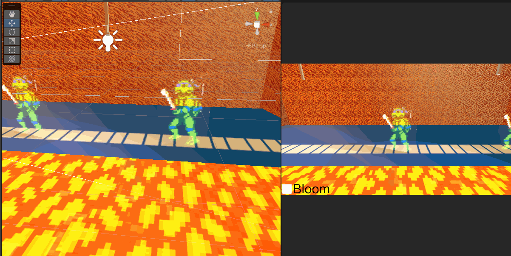

Handling Normals:

First declare in properties a texture (Make sure that texture is set to normals mode in Unity)
Also make a property for scale

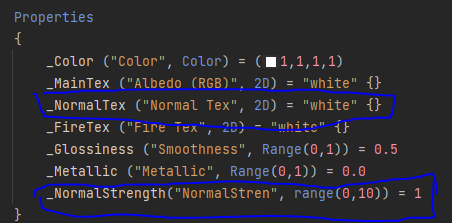

Then Using a standard surface shader, sample the texture and multiply by the scale and apply the normals'

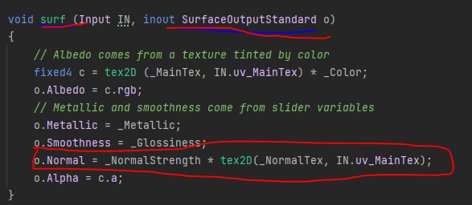

The final code here is used to mark the walls as stencil "Recievers" 
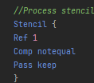

## Tiling Lava
I chose to do tiling lava because I figured it'd make more sense for the era, and I did wave water in the last one... It didn't look to good. In the shader I made sure to include Emissive properties to help the bloom look better, and  I made a script to help control turbulence.
That being said, the concept is very simple, it's two textures layered on top of each other, blended and moving at different speeds.

MODIFICATION: Normals, Custom speed modifications, Emission and HDR

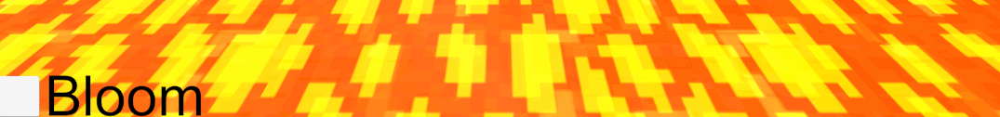

The code for the lava is a simple tile done here: it's just two textures tiled on top of each other. Nothing special.

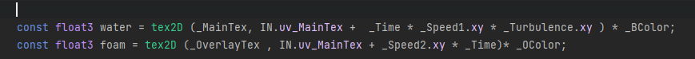

## Bloom
Bloom is implemented with a toggle that allows you to see how it affects the lava... I don't know how to make it any more meaninful...
Bloom works by taking the frame, and amplifying bright colors, specifically those with High Definition range *(Emissive properties). It creates the illusion of light by leeching color into the image and adds quite a bit of value into the scene
I didn't really have time to think about how else to modify this, so I only really added a toggle... Not sure what you'd want to do to modify this anyways, unless it'd be like a layer based check or implementing light sources (which I def don't have time for)

Modification: Toggle

Bloom on

Bloom off

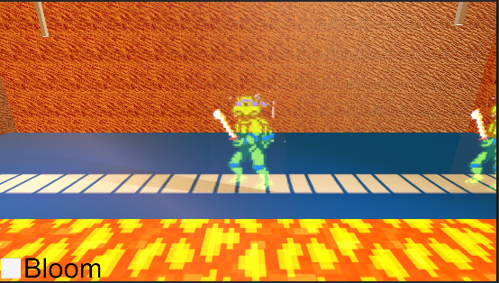

Toggle Code: (Simply have a UI toggle that if ON does the normal render pass, and if off immediately blits the source to the destination and that's it)

This check keeps it as optimized as possible, though the check if button is on could be more optimized.

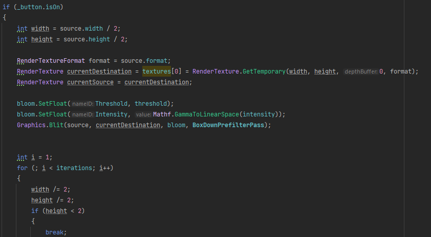

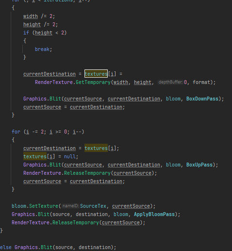

## Bonus: Stencil windows
Inspired by my time at game XP summit, I made a stencil to view a skybox that I dropped in. It's very simple, essentially all the walls contain stencil info allowing them to have their colour overwritten if an object with a higher Z value is in front of them. Then the window itself has a shader that simply just always replaces the object behind it.

Modification: STENCIL Writer

The image below shows the effect

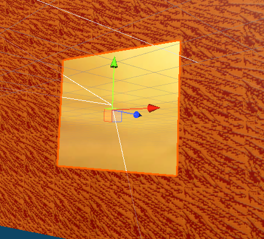

The code below is needed to "overwrite" the content behind it 

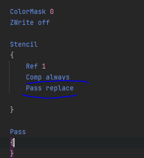

## Resources

[Skybox](https://assetstore.unity.com/packages/2d/textures-materials/sky/sunset-sun-skybox-pack-vol-ii-31511)

[To Normal Map](https://cpetry.github.io/NormalMap-Online/)

[Lava Overlay](https://www.freepik.com/premium-vector/lava-pixel-art-texture-magma-tile-seamless-pattern-8-bit-sprite_28762550.htm)

[Lava Base](http://pixelartmaker.com/art/bd068e6b4c9c503)